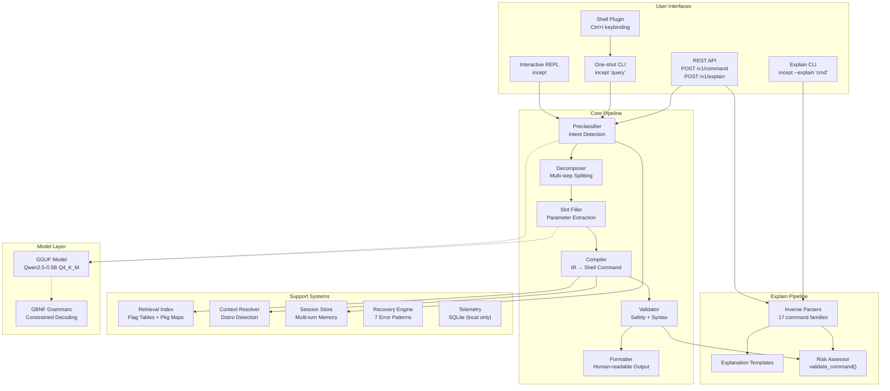
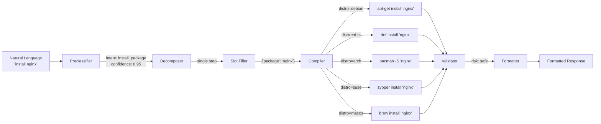
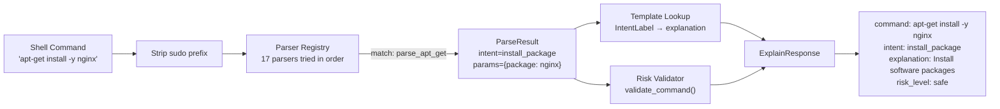
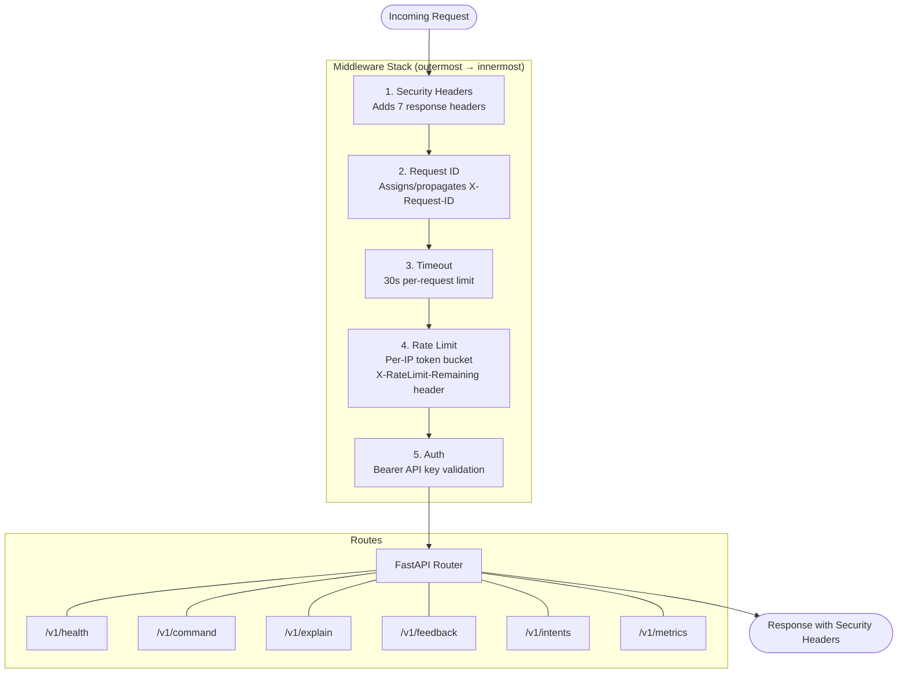
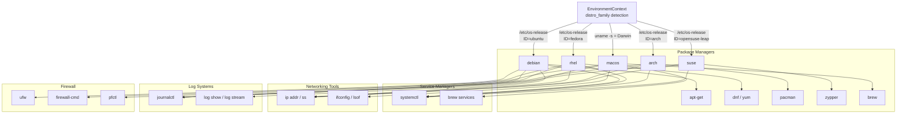
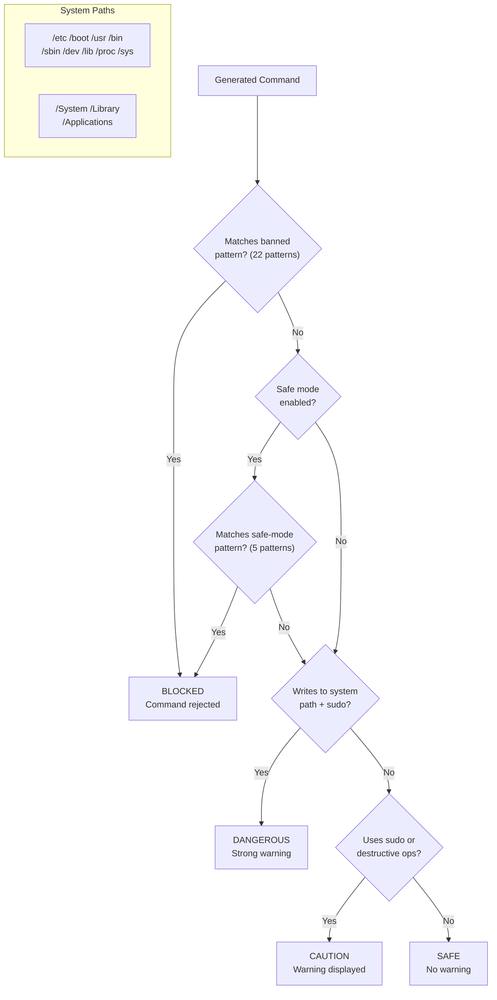
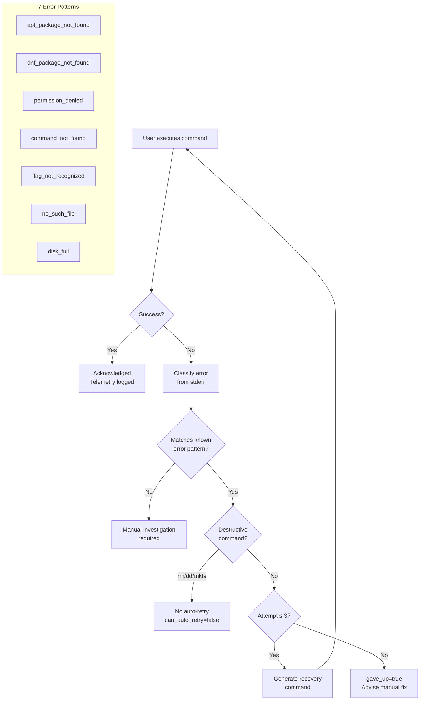
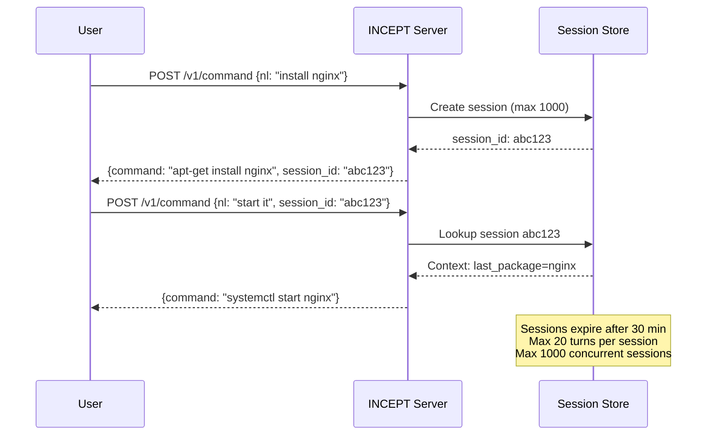
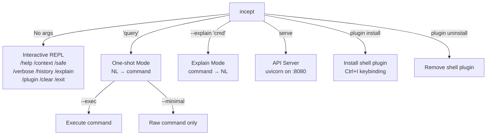
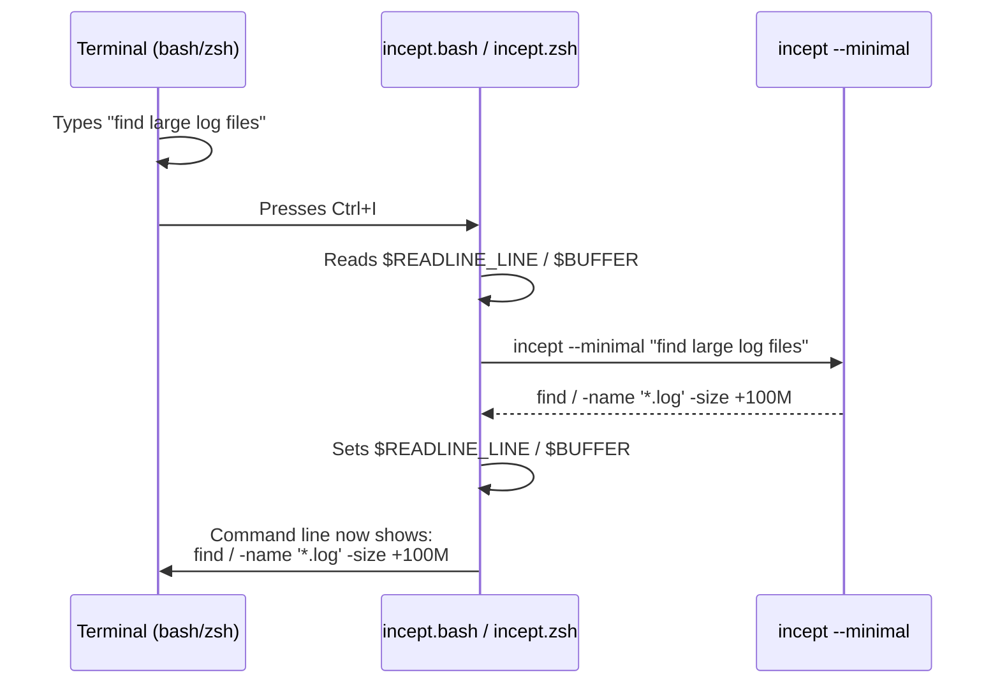

# Architecture

This document provides visual architecture diagrams for INCEPT's major subsystems.

## System Overview

## Core Pipeline Flow

## Explain Pipeline (Reverse Flow)

## Server Middleware Stack

Middleware is applied outermost-first. The request passes through each layer inward; the response passes back outward.

## Distro Family Architecture

## Safety & Risk Classification

## Error Recovery Loop

## Session & Multi-Turn Flow

## CLI Modes

## Shell Plugin Architecture

